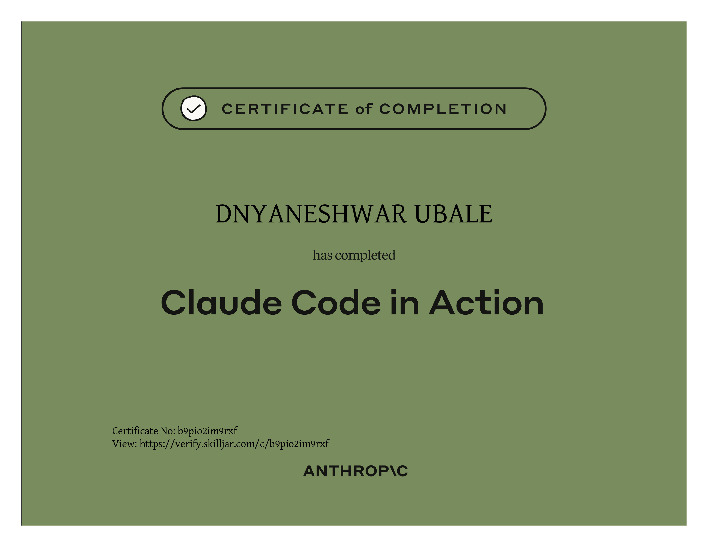

<h1 align="center">Hi 👋, I'm Dnyaneshwar Ubale</h1>

<h3 align="center">
Passionate Software Development Engineer in Test (SDET)  
UI & API Automation | 4+ Years of Experience
</h3>

SDET with 4+ years of hands-on experience in Manual and Automation testing across UI and APIs.
Experienced in building scalable automation frameworks, increasing test coverage, and
delivering high-quality, reliable software. Strong believer in clean code, CI/CD integration,
and continuous learning.

- 🔭 I’m currently working on [PhoenixTestAutomationFramework](https://github.com/Dnyaneshwar01/PhoenixTestAutomationFramework)

- 👨‍💻 All of my projects are available at [https://github.com/Dnyaneshwar01](https://github.com/Dnyaneshwar01)

- 📫 How to reach me **dnyaneshwarubale4720@gmail.com**

## 🌐 Socials:
  

# 💻 Tech Stack:
               
 

### 🤖 AI Development Assistance
- 
- 

## 🚀 Featured Project

### 📌 Test-Automation-Framework
- 🔗 Repo: https://github.com/Dnyaneshwar01/Test-Automation-Framework
- 📝 Description: Test Automation Framework built on Java 11 using TestNG and LambdaTest to run tests on the cloud, with support for parallel execution.
- 🛠 Tech: Java, Selenium.TestNg, Docker

### 📌 PhoenixTestAutomationFramework
- 🔗 Repo: https://github.com/Dnyaneshwar01/PhoenixTestAutomationFramework
- 📝 Description: Rest API Automation Framework
- 🛠 Tech: Java, Rest Assured, TestNg, MySQL

### 📌  Cucumber-BDD-Automation-Framework
- 🔗 Repo: https://github.com/Dnyaneshwar01/Cucumber-BDD-Automation-Framework
- 📝 Description: Cucumeber BDD Framework
- 🛠 Tech: Java, Cucumber BDD, Selenium

## 🏆 Certifications
#### 📜 Claude Code Certification

  

# 📊 GitHub Stats:
 
 

